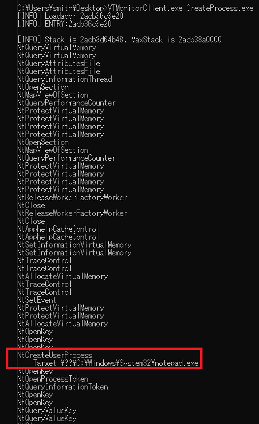

# VTMonitor
VTMonitor is a syscall hooking tool for **specific threads** with Intel VT-x.  
This tool can intercept direct system calls such as SysWhispers.  
You can write syscall handlers to modify behaviour or monitor args.  

Perhaps multi-processing and multi-threading can be supported if appropriate handlers are written.  
At least, NtCreateUserProcess and NtCreateThreadEx must be handled.  

Please only use this for simple programs. (VEH, SEH and others are not supported)


## Using
```
sc create <servicename> binpath=<path to VTMonitor.sys> type=kernel
sc start <servicename>
VTMonitorClient.exe <target.exe>
```
## Environment
- VS2019
- Windows10 x64 20H2
- Only 64bit

## Example
Monitoring program call CreateProcessW to launch notepad  


## Reference
- WSL1
- Hypervisor From Scratch
    - https://github.com/SinaKarvandi/Hypervisor-From-Scratch
- HAXM
    - https://github.com/intel/haxm
- Noah
    - https://github.com/linux-noah/noah

